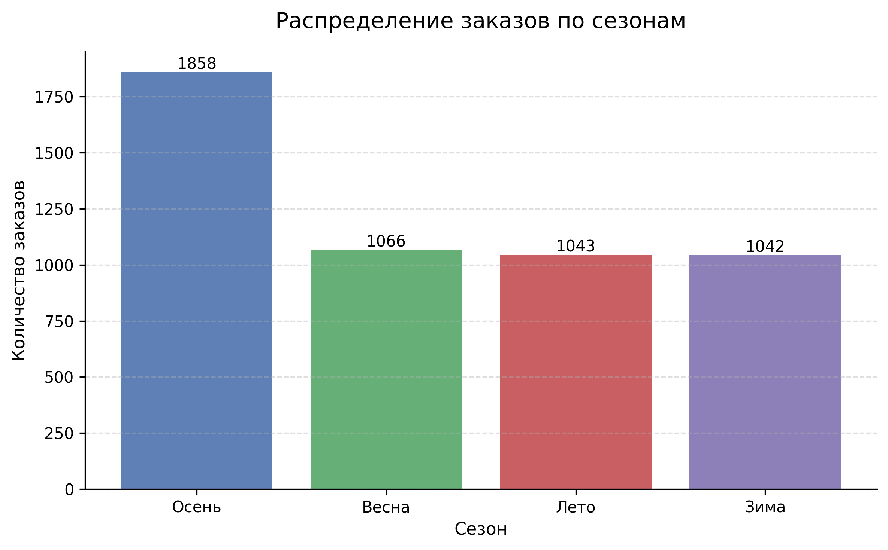

# 📊 Анализ закономерностей продаж (Superstore Sales Analysis)

## 📌 О проекте

В рамках проекта проведён комплексный анализ данных о продажах магазинов на основе датасета Superstore.  
Цель исследования — выявить закономерности в заказах и прибыли, определить сезонные и категориальные тренды, а также построить модель тренда ежедневной активности покупателей.

Проект направлен на выявление факторов, влияющих на выручку и прибыль, и формирование практических рекомендаций для оптимизации ассортимента и маркетинговой стратегии.

---

## 🎯 Цели и задачи

В рамках проекта были решены следующие задачи:

- Анализ сезонных, месячных и недельных трендов продаж  
- Определение наиболее активных периодов по количеству заказов и прибыли  
- Исследование динамики продаж по годам  
- Анализ прибыльности категорий и подкатегорий товаров  
- Выявление взаимосвязи между количеством заказов и прибылью  
- Построение тренда изменения среднего числа ежедневных заказов с использованием методов машинного обучения  

---

## 📂 Данные

Использован открытый датасет **Superstore**, содержащий:

- дату заказа  
- категорию и подкатегорию товара  
- количество заказов  
- выручку  
- прибыль  
- региональные и клиентские характеристики  

---

## 🛠 Используемые инструменты

- **Python**
- Pandas — обработка и трансформация данных  
- Matplotlib, Seaborn — визуализация  
- Scikit-learn — построение модели тренда  
- Анализ временных рядов  

---

## 📊 Основные этапы анализа

1. Предобработка данных:
   - очистка
   - преобразование дат
   - создание временных признаков (год, месяц, сезон, день недели)

2. Исследовательский анализ (EDA):
   - сезонные тренды
   - месячная динамика
   - распределение заказов по дням недели
   - анализ категорий и подкатегорий

3. Анализ прибыльности:
   - сравнение популярности и маржинальности категорий
   - выявление наиболее и наименее эффективных товарных групп

4. Построение тренда:
   - расчёт среднего числа ежедневных заказов
   - построение модели для выявления долгосрочной динамики

---

## 📈 Результаты

- Выявлены наиболее активные сезоны и месяцы продаж
  
- Определены дни недели с максимальной покупательской активностью
   
- Найдены наиболее прибыльные и наиболее популярные категории товаров  
- Выявлены различия между объёмом заказов и фактической прибыльностью  
- Построен тренд ежедневной активности покупателей  

---

## 💡 Практическая ценность

Полученные результаты позволяют:

- корректировать ассортиментную стратегию  
- планировать маркетинговые кампании с учётом сезонности  
- оптимизировать распределение ресурсов  
- учитывать различия между популярностью и прибыльностью товаров  

---

## 🚀 Возможное развитие проекта

- прогнозирование продаж на будущие периоды  
- добавление более сложных ML-моделей  
- анализ региональных различий  
- оценка влияния скидок на прибыль  

---
